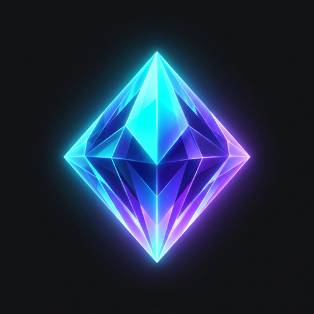
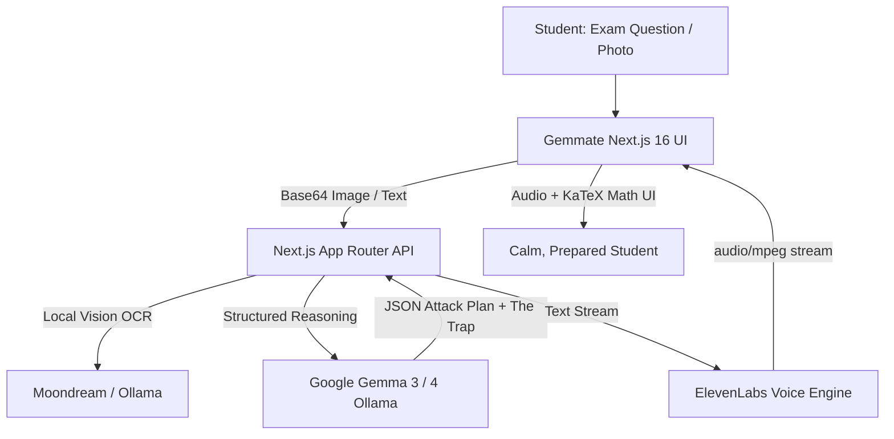

# 💎 Gemmate: Open-Source Voice Companion for Cracking Exam Traps

<div align="center">
  
  <br />
  <h3>Your open-weight voice study partner for mastering deceptive exam questions.</h3>
  <p><strong>Built for the DEV Hacktoberfest 2026 Challenge</strong></p>
  <p>
    <em>Competing in <strong>Best Use of Gemma ($200)</strong> & <strong>Best Use of ElevenLabs ($100)</strong></em>
  </p>
</div>

---

## 📖 Why Gemmate?

For students preparing for high-stakes technical exams, deceptive questions frequently trigger acute exam anxiety:

- Deceptive edge cases (e.g. assuming worst-case hash collisions are $O(1)$)
- Subtly contradictory boundary constraints and unit tricks
- Overwhelming blocks of text designed to induce time panic

Generic AI tools fail students: pasting a question into standard chatbots dumps walls of final answers, robbing them of the chance to learn how to deconstruct traps. Furthermore, expensive subscription fees and spotty Wi-Fi in underground library basements make cloud-only assistants unreliable.

**Gemmate** solves this: an empathetic, open-weight AI companion that **never reveals direct answers**. Instead, it uses **Google Gemma** to triage the problem into an actionable Attack Plan, while **ElevenLabs** provides a comforting Socratic voice to talk through the trap out loud.

---

## ✨ Features

- 🧠 **Google Gemma Open-Weight Reasoning**: Local inference via Ollama (`gemma3:1b` / `gemma4:12b`) for sub-second, 100% private and offline study sessions.
- 🎙️ **ElevenLabs Socratic Voice Coach**: Audio breakdown of Attack Plans and progressive hints streamed in real-time (`audio/mpeg`) with animated soundwaves.
- 📸 **Dual Input Flexibility**: Upload photos of printed exams (transcribed via Moondream vision model) or paste markdown directly with 3 instant sample questions.
- 🎯 **Exam Trap Deconstruction**: Extracts _Core Concepts_, _The Trap_, and a sequential 4-step _Attack Plan_.
- 💡 **Progressive Socratic Hints**: Nudges the student forward step-by-step without spoiling the final answer.
- ✏️ **Targeted Practice Drills**: Dynamically generates fresh drill questions targeting the exact same trap with new variables.
- 🌐 **Why Open Innovation Matters**: A dedicated in-app modal articulating why local open-source AI defends student equity, privacy, and offline accessibility.

---

## 🛠️ Architecture & Tech Stack



- **Framework**: Next.js 16 (App Router, Turbopack), React 19, Tailwind CSS v4, Framer Motion
- **Open-Source AI Engine**: Google Gemma (`gemma3:1b`, `gemma4:12b` via local Ollama; Groq `gemma2-9b-it` / Google AI Studio cloud fallback)
- **Voice Intelligence**: ElevenLabs Text-to-Speech API with chunked streaming & in-memory caching
- **Typography & Math**: KaTeX, `remark-math`, `rehype-katex`, Outfit / Inter fonts

---

## 🚀 Getting Started

### 1. Prerequisites

- [Node.js](https://nodejs.org) (v20+)
- [Ollama](https://ollama.com) (for local open-weight inference)
- [ElevenLabs API Key](https://elevenlabs.io) (for voice playback)

### 2. Setup Ollama Models

```bash
# Pull lightweight Gemma 3 (fits 100% in consumer GPU VRAM)
ollama pull gemma3:1b

# Optional: Vision model for image transcription
ollama pull moondream:latest
```

### 3. Installation

```bash
# Clone the repository
git clone https://github.com/inusha-thathsara/Gemmate.git
cd Gemmate

# Install dependencies
npm install
```

### 4. Configure Environment

Create a `.env.local` file in the project root:

```env
# Local Gemma Engine (Ollama)
OLLAMA_BASE_URL=http://localhost:11434
OLLAMA_MODEL=gemma3:1b
OLLAMA_FALLBACK_MODEL=gemma4:12b

# ElevenLabs Voice AI
ELEVENLABS_API_KEY=your_elevenlabs_api_key_here
ELEVENLABS_VOICE_ID=21m00Tcm4TlvDq8ikWAM

# Cloud Fallback (Optional for cloud deployments)
GROQ_API_KEY=your_groq_api_key_here
GEMMA_CLOUD_MODEL=gemma2-9b-it
```

### 5. Run Development Server

```bash
npm run dev
```

Open [http://localhost:3000](http://localhost:3000) to view the app!

---

## ☁️ Deployment (Render / Vercel)

Gemmate is production-ready.

### On Render:

1. Create a **New Web Service** and connect this repository.
2. Set **Build Command**: `npm install && npm run build`
3. Set **Start Command**: `npm start`
4. In **Environment Variables**, add:
   - `ELEVENLABS_API_KEY`
   - `ELEVENLABS_VOICE_ID`
   - `GROQ_API_KEY` _(or `GEMINI_API_KEY` for cloud open-weight Gemma fallback)_

---

## 📄 License

Distributed under the MIT License. See `LICENSE` for more information.
